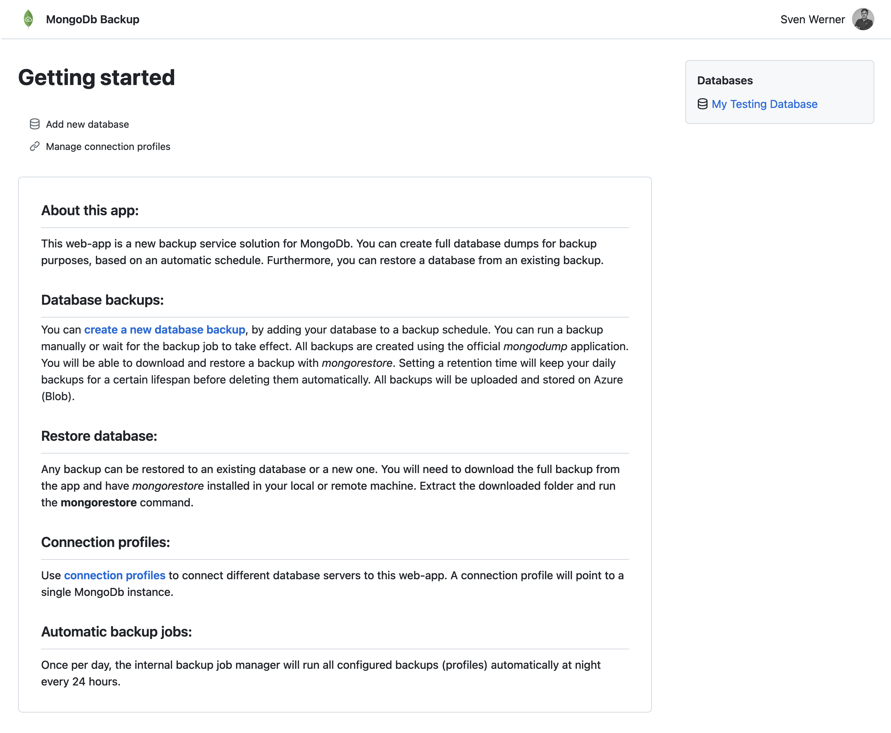
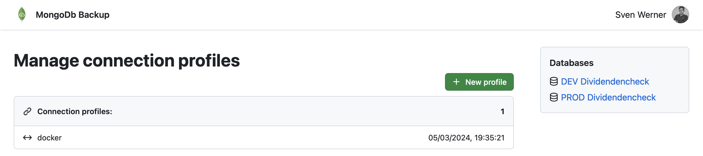
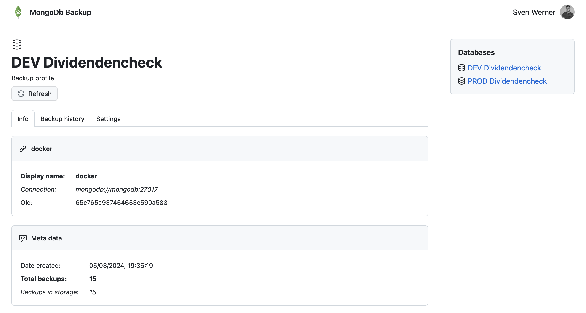
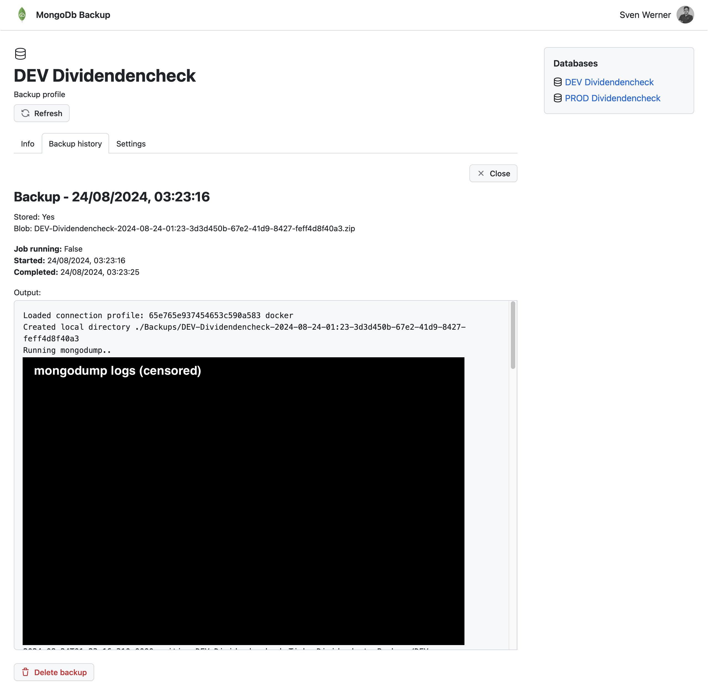
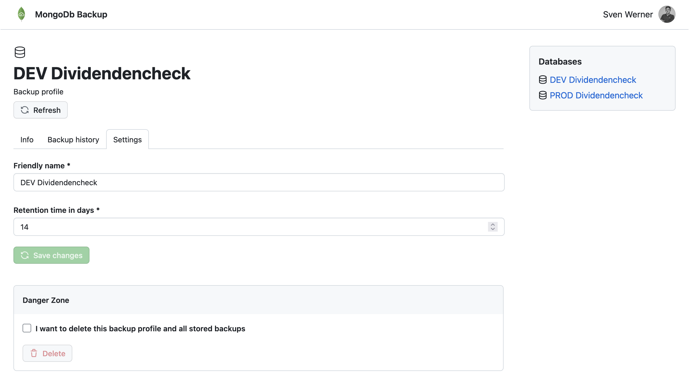

# AZ-MongoBak - Demo / Showcase
The following demo showcases an actual production deployment. Some values had to be censored for security reasons.

## Landing page

## Connection profiles
You can configure multiple connection profiles to create backup for many differen mongodb instances.

## Backup profile
Backup profiles define backup settings for a single database.

## Backup history
All backups can be viewed here. In addition to the backup data, all logs during backup are stored as well.

## Backup settings
Currently you are only able to set / change the retention time. It is currently not possible to 'pause' a backup profile. A new backup will be created every 24 hours.

